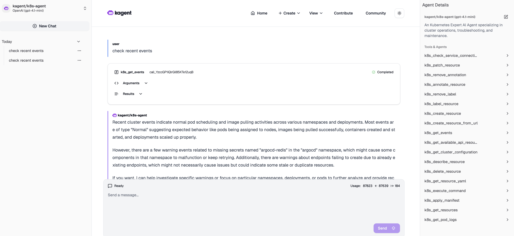

# Kagent

[Kagent docs](https://kagent.dev/docs/kagent)

## Installation

```bash
curl https://raw.githubusercontent.com/kagent-dev/kagent/refs/heads/main/scripts/get-kagent | bash
```

```bash
export OPENAI_API_KEY=<key>
kagent install
```

```bash
# install argocd
kubectl create namespace argocd
kubectl apply -n argocd -f https://raw.githubusercontent.com/argoproj/argo-cd/stable/manifests/install.yaml

# accessing via loadbalancer
kubectl patch svc argocd-server -n argocd -p '{"spec": {"type": "LoadBalancer"}}'
# get IP
kubectl get svc argocd-server -n argocd -o=jsonpath='{.status.loadBalancer.ingress[0].ip}'
```

```bash
# install kagent from local argocd manifests
./argocd/deploy.sh
```

This deploys a bunch of agents. Run `kagent dashboard` and test one of the agents from the ui.

For example, this is using the k8s-agent to check recent k8s events:


