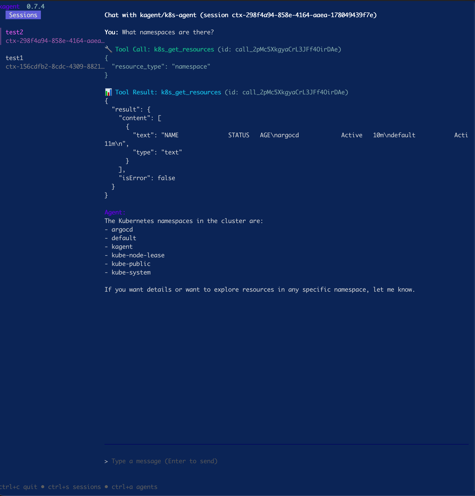

# Kagent

[Kagent docs](https://kagent.dev/docs/kagent)

## Installation

```bash
# installing the kagent cli
curl https://raw.githubusercontent.com/kagent-dev/kagent/refs/heads/main/scripts/get-kagent | bash
```

### Option 1: Installing kagent using the kagent cli

```bash
export OPENAI_API_KEY=<key>
kagent install -n kagent
```

### Option 2: Installing kagent using ArgoCD

```bash
# install argocd
kubectl create namespace argocd
kubectl apply -n argocd -f https://raw.githubusercontent.com/argoproj/argo-cd/stable/manifests/install.yaml

# accessing via loadbalancer
kubectl patch svc argocd-server -n argocd -p '{"spec": {"type": "LoadBalancer"}}'
# get IP
kubectl get svc argocd-server -n argocd -o=jsonpath='{.status.loadBalancer.ingress[0].ip}'
```

```bash
# install kagent from local argocd manifests
./argocd/deploy.sh
```

## Using kagent

Once installation is finished run either `kagent` for the TUI or `kagent dashboard` for a web ui test one of the agents.




## Installing custom agents

`kubectl apply -f` any of the [agent manifests](./agents/)

(There is also `kagent deploy` but for this experiment `kubectl` is fine)
