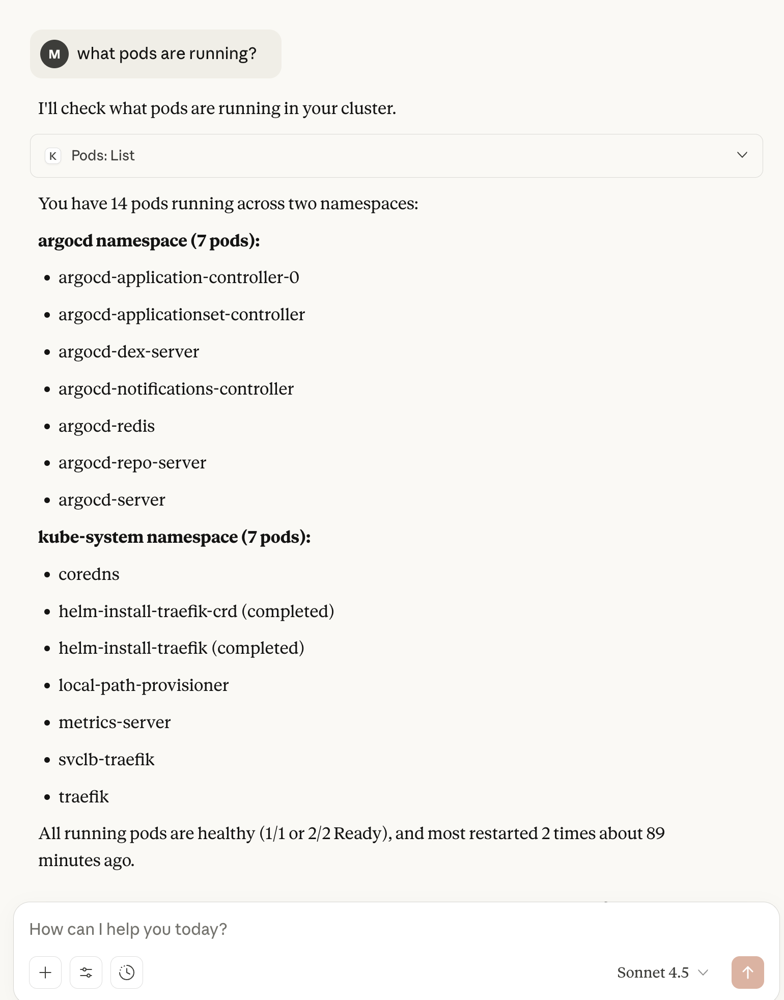

# MCP-Experiments

## Option 1: Connect (via SSH) to Kubernetes MCP Server

[Kubernetes MCP Server](https://github.com/containers/kubernetes-mcp-server) can be run in several ways, we run it via `uv`:

```bash
uvx kubernetes-mcp-server
```

### Using Claude Desktop as MCP client

[Claude's docs on how to connect to a local server](https://modelcontextprotocol.io/docs/develop/connect-local-servers)

This config connects Claude Desktop to the VM via SSH, runs the MCP server in STDIO mode via uv's uvx:

```json
{
  "mcpServers": {
    "kubernetes": {
      "command": "ssh",
      "args": [
        "user@vm",
        "uvx",
        "kubernetes-mcp-server"
      ]
    }
  }
}
```


Why via SSH? Kubernetes MCP Server supports running as a remote server but it's cumbersome to connect Claude Desktop to a MCP.

**Follow logs in real-time**

```bash
# With Claude Desktop running on MacOS
tail -n 20 -F ~/Library/Logs/Claude/mcp*.log
```
